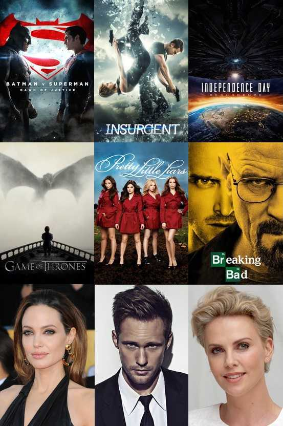

# Movie Maniac

Movie Maniac is an open source Android project powered by [TMDb](https://www.themoviedb.org/) APIs. 
I strive to keep it in an active state of development. Your suggestions for improvements and feedback are most welcome. 
Movie Maniac currently consists of features pertaining to movies, tv series, celebrities and game.

## Background Screen

## Getting Started

If you wish to get this project up and running, you'll need to follow these steps:

1. Download Google Android Studio
2. Create a TMDb account and register for an [API key](https://www.themoviedb.org/documentation/api)
3. Insert the API key in the NetworkConstants.java file
4. Run the project from Android Studio

## Powered by these open source projects

1. [Jackson Databind, Jackson Annotations](https://github.com/FasterXML)
2. [Android Volley](https://github.com/mcxiaoke/android-volley)
3. [Glide Image Library](https://github.com/bumptech/glide)
4. [Materialish Progress](https://github.com/pnikosis/materialish-progress)
5. [Pager Sliding Tab Strip](https://github.com/astuetz/PagerSlidingTabStrip)

## Authors

**Adithya H K Upadhya** 

You can contact me through
* [Linkedin](https://in.linkedin.com/in/adithya-upadhya-2021b582)
* [Facebook](https://www.facebook.com/hkuadithya)
* [Gmail](mailto:developer.moviemaniac@gmail.com)

## License

This project is licensed under the  GNU GENERAL PUBLIC LICENSE - check the [LICENSE.md](LICENSE.md) file for details

## Acknowledgments

Special Thanks to
* [Mayur Devatwal](https://www.behance.net/mayurdevatwal) for developing the app icons
* My family
